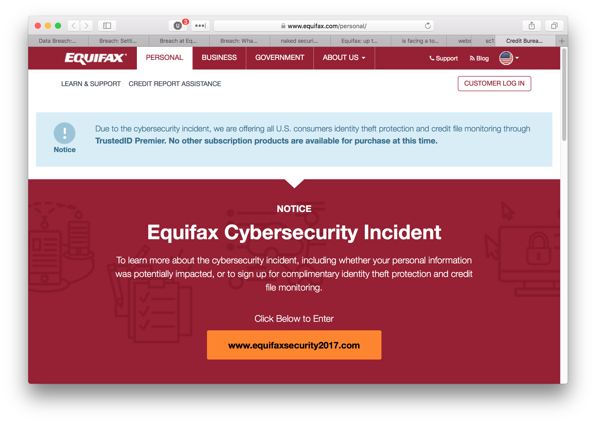
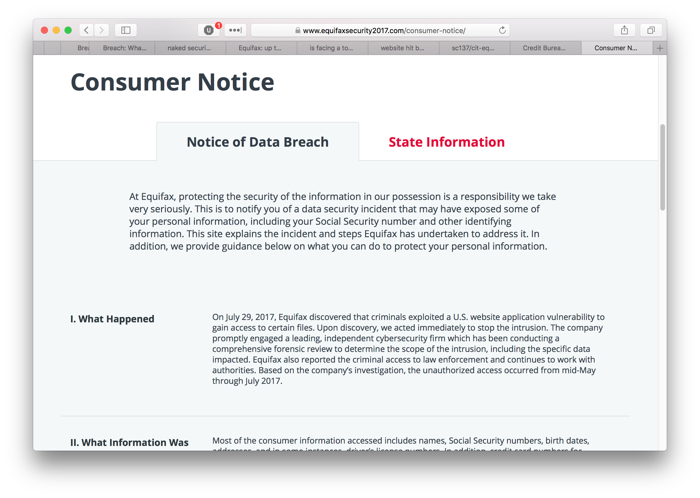
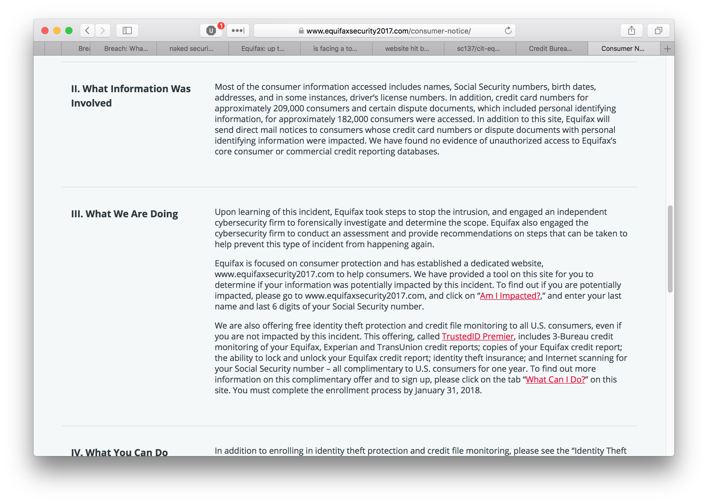

% The Equifax Data Breach
% J Sable Cantus
% November 3rd, 2017

#
Prepared for the fine folks at Rio Hondo College

#
Access this presentation on the web:

[https://sc137.github.io/cit-equifax/](https://sc137.github.io/cit-equifax/)

# About Me

* Technology Systems Trainer at Rio Hondo College (since 2011)
* Adjunct Faculty at Golden West College (since 2009)
* [My Website](http://cantus.us/)

# The Prompt

Discuss what may have happened and demonstrate what cybersecurity protocols could have prevented this breach

#

# What is Equifax?

* one of the “big three” credit bureau’s (Transunion, Experian, Equifax)
* a credit reporting agency
* reports credit scores
* sells your information to businesses
* e.g. loan applications, background checks, etc.

# What Do They Claim?

* Equifax reports they discovered “unauthorized access” on July 29, 2017
* Claims attackers took advantage of an application exploit

#

# What Happened?

* Was it an un-patched Struts installation?
* Apache Struts - A Server-side JAVA-based web design framework.
* attackers might have had access for 2 1/2 months…

# Who is affected?

* 143 million Americans
* Probably those of us in this room...
* Foreign citizen's information as well

# What Information Was Lost?

* Social Security Numbers
* birth dates
* addresses
* some credit card numbers
* some drivers license numbers

#

# How could Equifax have prevented this?

* Apply security patches regularly
* Consult with security firms for regular auditing and scanning
* Maintain and fund a company information security policy

# Regular Security Patching

* Software providers fix bugs and vulnerabilities in their software
* Researchers disclose problems
* Equifax must plan and staff regular updates

# Auditing and Scanning

* Find problems early
* Equifax should have regular (weekly, monthly, quarterly) security scans
* Internal and External
* Equifax should hire a private security firm to scan and test

# Information Security Policy

* patch management
* testing
* auditing and scanning
* log management
* controlled access

# Doesn’t Everyone Get Hacked?

It's an ever increasing risk of doing business.
If a breach does occur, follow your Incident Response Plan

# resources

* [https://krebsonsecurity.com/2017/09/breach-at-equifax-may-impact-143m-americans/](https://krebsonsecurity.com/2017/09/breach-at-equifax-may-impact-143m-americans/)
* [https://nakedsecurity.sophos.com/2017/10/11/equifax-15-million-more-at-risk/](https://nakedsecurity.sophos.com/2017/10/11/equifax-15-million-more-at-risk/)
* [https://nakedsecurity.sophos.com/2017/10/31/equifax-is-facing-a-towering-pile-of-class-action-law-suits/](https://nakedsecurity.sophos.com/2017/10/31/equifax-is-facing-a-towering-pile-of-class-action-law-suits/)
* [https://nakedsecurity.sophos.com/2017/10/13/equifax-website-hit-by-malvertising-will-the-pain-never-end/](https://nakedsecurity.sophos.com/2017/10/13/equifax-website-hit-by-malvertising-will-the-pain-never-end/)
* [https://krebsonsecurity.com/2017/09/the-equifax-breach-what-you-should-know/](https://krebsonsecurity.com/2017/09/the-equifax-breach-what-you-should-know/)
* [https://krebsonsecurity.com/2017/09/equifax-breach-setting-the-record-straight/](https://krebsonsecurity.com/2017/09/equifax-breach-setting-the-record-straight/)

# resources (cont'd)

* [https://www.bloomberg.com/news/features/2017-09-29/the-equifax-hack-has-all-the-hallmarks-of-state-sponsored-pros](https://www.bloomberg.com/news/features/2017-09-29/the-equifax-hack-has-all-the-hallmarks-of-state-sponsored-pros)
* [https://www.wired.com/story/equifax-breach-no-excuse/](https://www.wired.com/story/equifax-breach-no-excuse/)
* [https://www.marketplace.org/2017/09/18/world/how-equifax-hack-could-have-been-avoided](https://www.marketplace.org/2017/09/18/world/how-equifax-hack-could-have-been-avoided)
* [https://www.sans.org/security-resources/policies](https://www.sans.org/security-resources/policies)
* [https://www.sans.org/security-resources/policies/application-security#web-application-security-policy](https://www.sans.org/security-resources/policies/application-security#web-application-security-policy)

# Questions?

# Thank You!

>You may view the code for
this presentation [here](https://github.com/sc137/cit-equifax)
