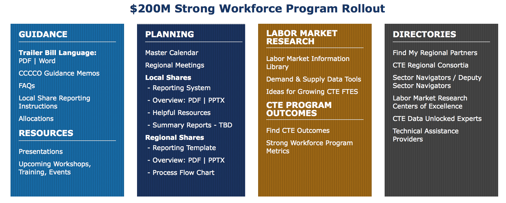
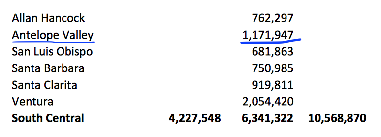
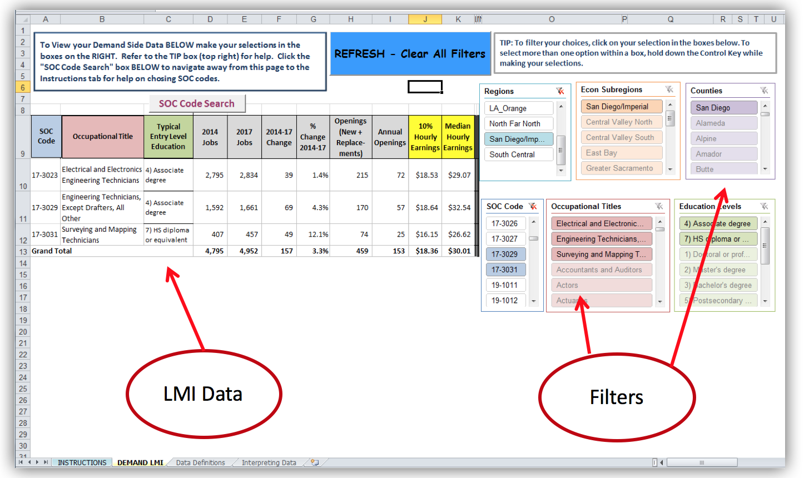
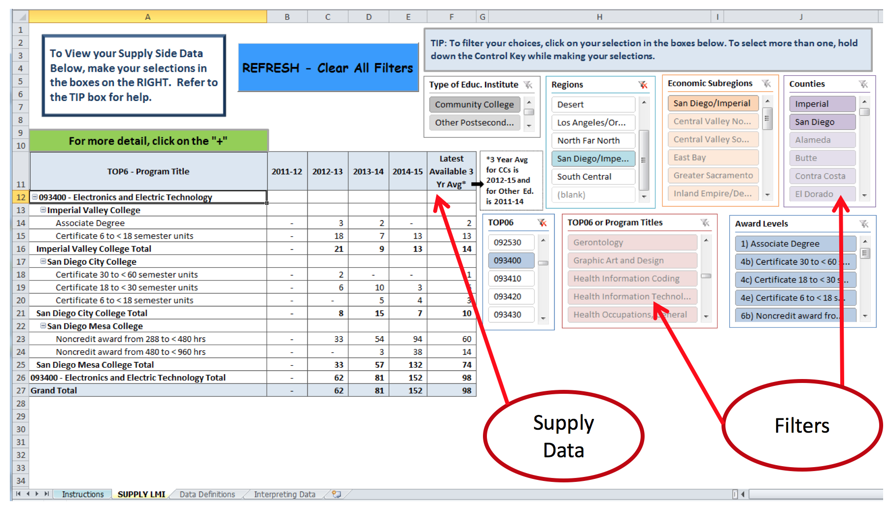
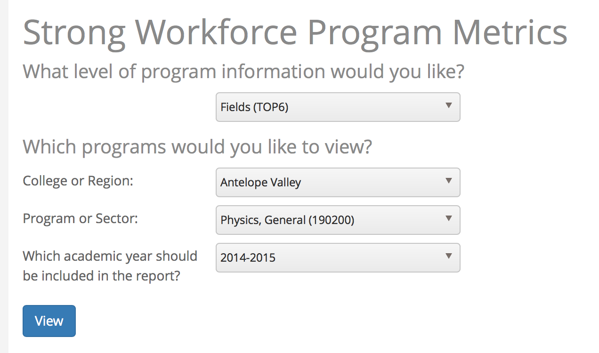
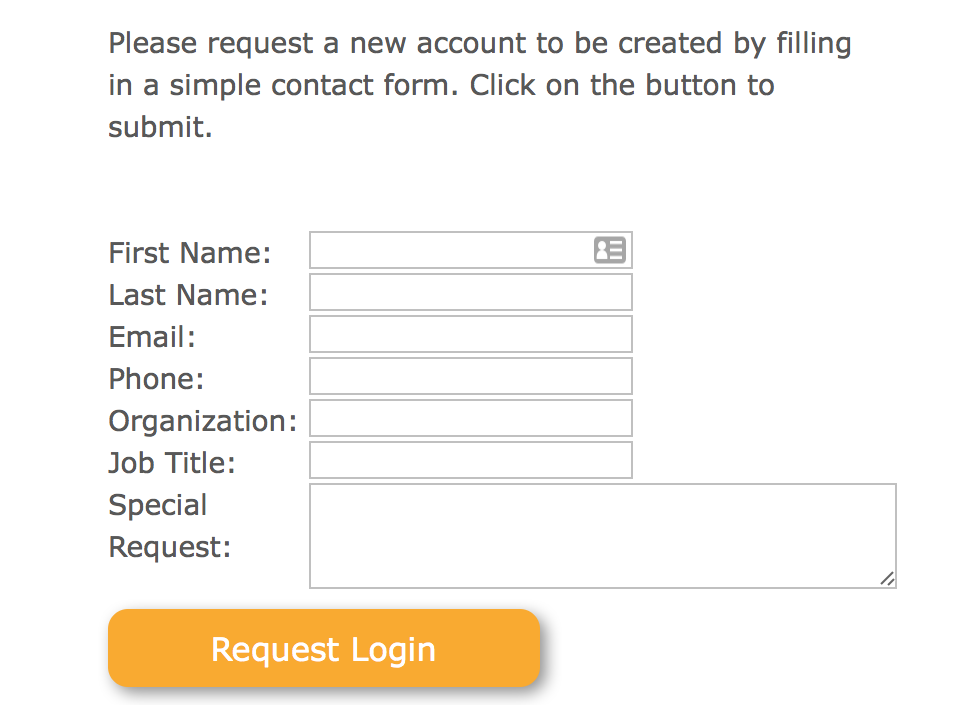
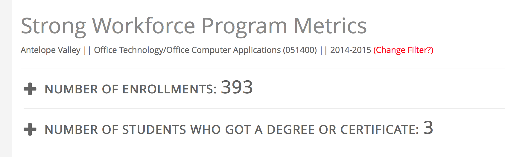
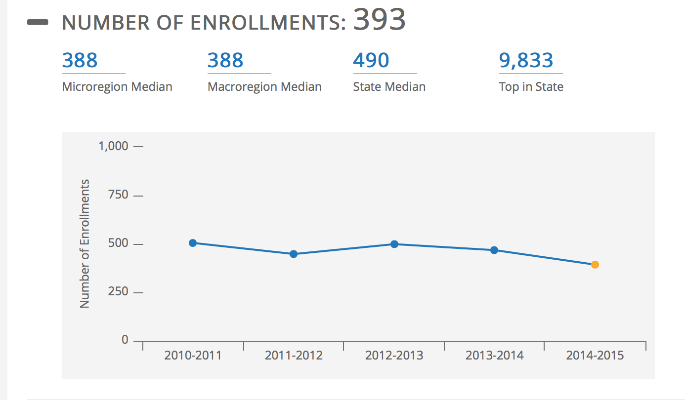

% Supporting Your Strong Workforce Application
% Antelope Valley College
% Sable Cantus, CTE Data Unlocked

# What is [Strong Workforce](http://doingwhatmatters.cccco.edu/StrongWorkforce.aspx)?

# 
The Strong Workforce Program is hereby established for the purpose of expanding the availability of quality community college career technical education and workforce development courses, programs, pathways, credentials, certificates, and degrees.

*Trailer Bill Excerpt*

# Distribution

* Funds are ongoing and have been allocated to colleges based on a labor market need, enrollments, and student outcomes, rather than putting out an RFP.
* Plans and budgets are very simple, focusing on proof of labor market need and projections regarding how student outcomes will change.

# Allocation

$1,171,947

# Focus for the Funds

* Increase the **quantity** of CTE
* Increase the **quality** of CTE

# Quantity

* More enrollments in programs leading to high-demand, high wage jobs

# “more”
*required for all programs*
* Enrollments

# Quality

* More students complete/transfer
* More students employed
* More students improving their earnings

# “better”

*pick only those metrics that are relevant for your investment*

* Completion
* Transfer
* Employment 
* Employment in field of study
* Second quarter earnings
* Median change in earnings
* Proportion of students who attained a living wage

# Funding

* Colleges will receive 2016-17 funding once their district certifies the local share report template.

**This is DUE soon**

# Guidance

* [CCCCO Guidance Memos](http://extranet.cccco.edu/Divisions/WEDDivision/StrongWorkforceMemos.aspx)

* [Guidelines, Definitions and Reasonable Standards for Strong Workforce Funding Investment](http://extranet.cccco.edu/Portals/1/WED/SWP/Guidelines_Reasonable%20Standards_final09-14.pdf)

# 

* No Supplanting
* Funding CTE Only
* No Duplication of Effort
* Follow District Procedure

# Non-Allowable

* Entertainment
* Alcoholic Beverages
* Contingency or Rainy Day Funds
* Goods and Services for Personal Use
* Lobbying
* Contributions or Donations
* Fund Raising and Investment costs

# Valid LMI Sources

* Use data that was validated within the last two years

* Validated local or regional employer input through an employer survey or advisory
	* Regional program approval process
	* Prior regional planning process 
	* Local biannual program review

* Find data in a report in the [LMI Resource Library](http://doingwhatmatters.cccco.edu/StrongWorkforce/LMILibrary.aspx) 

* [Demonstrate living wage attainment](https://www.calpassplus.org/LaunchBoard/SWP.aspx) (*Programs where at least 50% of students earned a living wage*)

# 
](img/swf3.png)

# 
](img/swf4.png)

#

#

#
Colleges should not compile this information on their own.

* All data points have been pre-populated on the LaunchBoard Strong Workforce Program tab, with benchmarking information.

#
](img/swf7.png)

#
](img/swf8.png)

#

#
[Login or create a my.calpassplus.org account to access the Launchboard](https://www.calpassplus.org/user/login.aspx?ReturnUrl=%2fLaunchBoard%2fSWP.aspx)

#

#

#

#
](img/swf14.png)

#
](img/swf13.png)

# FAQ’s

* Get the [Quickstart Guide](http://doingwhatmatters.cccco.edu/portals/6/docs/sw/Local%20Share%20Reporting%20Template%20Quick%20Start%20Guide.pdf)

* [Doing What Matter’s FAQs](http://doingwhatmatters.cccco.edu/StrongWorkforce/FAQ200MRollout.aspx)

#
* [Understanding Employment and Earnings Data](http://doingwhatmatters.cccco.edu/portals/6/docs/Understanding%20Employment%20&%20Earnings%20Data%20infographic%205%20links.pdf)
* [What Are the Data Sources in the LaunchBoard?](http://doingwhatmatters.cccco.edu/portals/6/docs/Data%20Sources%20in%20the%20Launchboard%20infographic.pdf)

# Questions?

# Thank You!
