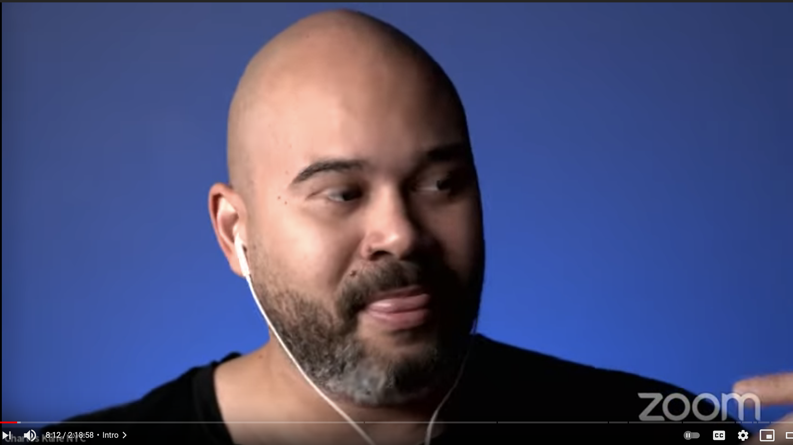

% Take Your Zoom to a Higher Level
% Sable Cantus
% 8/20/21

#
Welcome to Fall Flex Day 2021

#
Welcome back to Zoom

#
What makes someone look and sound good in zoom?

#
Let's look at some examples from Alex Lindsey's "Office Time" channel.

#

#

#

#

#

#
Our online video presentation is a tool that is used to help us get our ideas across to other people.

#
We show our professionalism when we present our best possible presence.

#
What makes a zoom call "good"?

#
1. Good internet connection
2. Clear and loud dedicated microphone
3. Separate webcam properly positioned
4. Clear lighting
5. Tidy background or backdrop

#
What is a good internet connection?

- What challenges do we have?

#
Clear and loud dedicated microphone

- The built in laptop mic is usually not good enough to be heard clearly
- USB mics and headsets range in price

#
Separate webcam properly positioned

- Webcam should be on a stand and about eye level
- Your portrait should follow the "rule of thirds"
- Logitech Camera Settings app

#

#
Clear lighting

- avoid windows behind you
- avoid direct sunlight
- some light under the chin

#
Tidy background or backdrop

- move articles of clothing out of the "camera shot"
- position your desk to get a clean wall or bookcase
- include personal items if that suits you
- build or buy a green screen

#
Handouts are available [on 3C Media](https://3cmediasolutions.org/files/?f=2892&key=e9b7a0dc81324b2e015f2ebc622f9e4721956da0)

#
Questions?

#
Now YOU will be able to take your zoom to a higher level.

#
Thank you!

#

